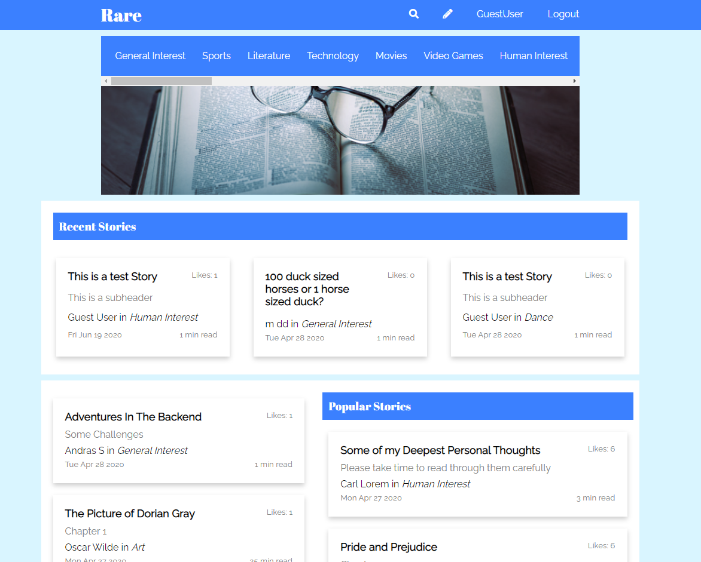
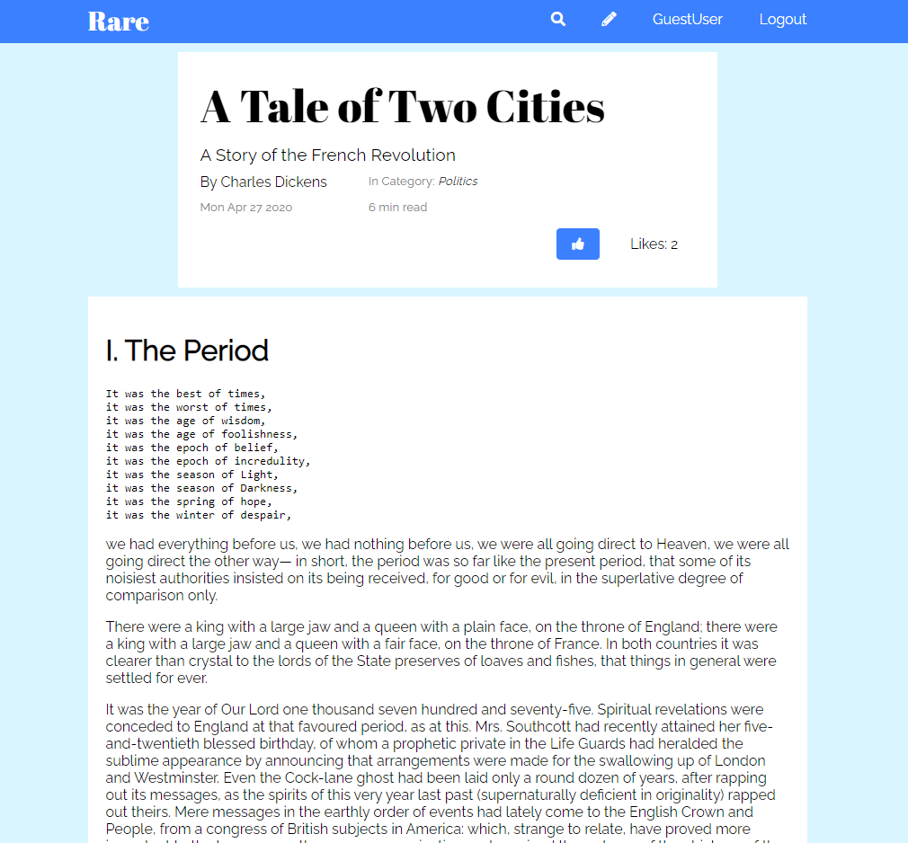
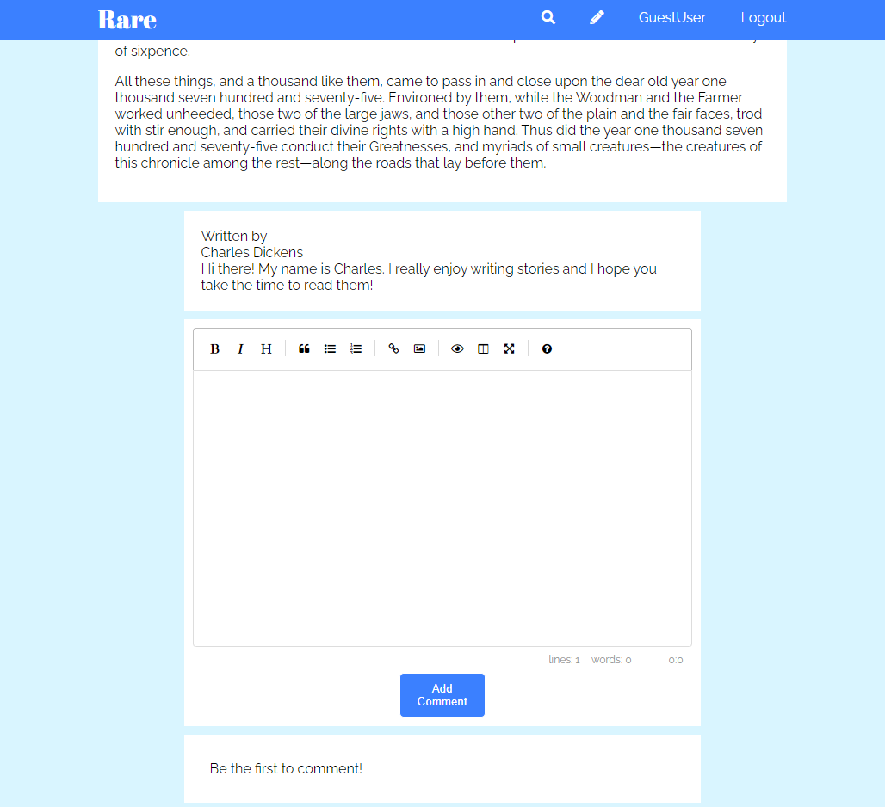
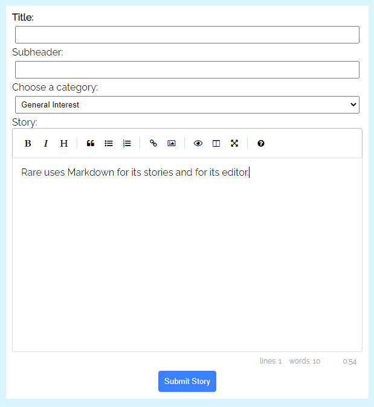

# Rare - A Medium Clone

> A reimagining of [Medium](https://medium.com/).

- [Rare - A Medium Clone](#rare---a-medium-clone)
  - [Overview](#overview)
    - [Splash](#splash)
    - [Index](#index)
    - [Story page](#story-page)
  - [Front-end](#front-end)
    - [Pug](#pug)
    - [Markdown](#markdown)
  - [Back-end](#back-end)
  - [Conclusion](#conclusion)

## Overview

Rare, [found here](https://group-project-rare.herokuapp.com/), is a social journalism site that allows users to publish and share articles on any topic they find relevant.

Social journalism is about empowering users by giving them the tools (and the audience) to make their stories expressive and impactful. And finding a site that does that well is... well, Rare.

That's where we come in. Rare gives users access to a [Markdown](https://www.markdownguide.org/) editor that gives them the freedom to choose what they want to say and how they want to say it. Story tags, likes, and comments also give users an opportunity to engage with the stories being told on the platform. Lastly, Rare presents articles openly and honestly based on each users own personal preferences. We don't have our own agenda (or some algorithim's) baked into what articles are shown to our users.

### Splash
This page welcomes new or logged out users, encouraging them to register.


### Index
Once logged in, users are directed to the index where they can view the latest and most popular stories.



### Story page
The story page supports all the features that Markdown provides, such as headers and other formatting, as well as displaying images.



The story page also uses a Markdown editor for comment support.



## Front-end
Rare uses plain JavaScript with HTML, CSS, Pug, and Markdown for handling text.

### Pug
Pug is an HTML template engine that allowed us to create a re-usable HTML-like base to then style with CSS and edit content with JavaScript.

```
  //story.pug
  .story-container.text-style2
      .story-title.text-style1.story-container-text
      .story-subheader.story-container-text
```

```js
  //stories.js
        const { story, readTime, parsedBody, storyLikes } = await res.json();
        document.querySelector(".story-title").innerHTML = story.title;
        document.querySelector(".story-subheader").innerHTML = story.subHeading;
```

### Markdown
Markdown serves as a familiar and easy to use format for writers to post stories and comments. The specific editor we chose to use is [EasyMDE](https://github.com/Ionaru/easy-markdown-editor#readme).

View of the editor:



## Back-end
The back-end uses Node, an Express server, Sequelize, and a PostgreSQL database.

## Conclusion
This project showed us that a lot can be done even with only vanilla JavaScript, provided we are willing to dive into the CSS styling and changing site content.
